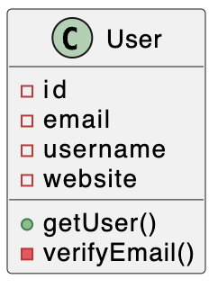

# Example

Let's assume we have a small webapp with users and their websites.

## Architecture

| Class             | Description                                         |
| ----------------- | --------------------------------------------------- |
| `User`            | Simple class to manage user data                    |
| `WebsiteVerifier` | Abstract class, verifiesstatus code 200 on websites |
| `IdGenerator`     | abstract IdGenerator class, to generate user id's   |

- The `IdGenerator` has a `generateId()` method that returns a new id.
- The `WebsiteVerifier` has a `verify(website: string)` method that returns a boolean.

## Mermaid

Support to follow.

## PlantUML

### User

#### Command

```bash
npx ankh-tools uml \
  --rootFile "src/examples/uml/User.ts" \
  --outDir "."
```

#### Output


